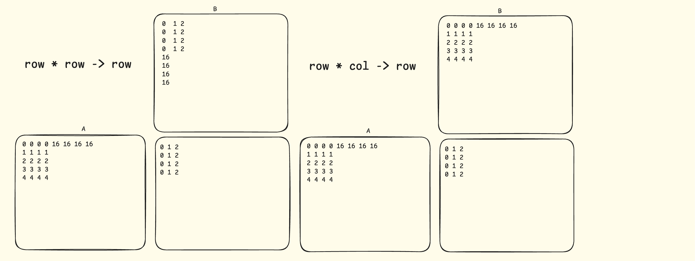

# Matmul on MI300X

Resources:

- Mi300 instruction set: https://www.amd.com/content/dam/amd/en/documents/instinct-tech-docs/instruction-set-architectures/amd-instinct-mi300-cdna3-instruction-set-architecture.pdf
- tilelang gemm: https://github.com/tile-ai/tilelang/blob/v0.1.6.post1/src/tl_templates/hip/gemm.h
- seb-v fp32 gemm: https://seb-v.github.io/optimization/update/2025/01/20/Fast-GPU-Matrix-multiplication.html
- fp8-gemms https://github.com/RadeonFlow/RadeonFlow_Kernels
- Matrix-core: https://github.com/LeiWang1999/leiblog.wang/blob/master/source/_posts/High-Performance-AMD-Matrix-Core.md
- amd-lab-notes: https://github.com/amd/amd-lab-notes/blob/release/matrix-cores/src/mfma_fp32_16x16x16fp16.cpp


`__builtin_amdgcn_mfma_f32_16x16x16f16` instructions.



M=N=K=4096, BF16

ROCm 6.3

| Kernel name                 | TFLOPS |
| --------------------------- | ------ |
| PyTorch (2.8.0+rocm6.4)     | 548.09 |
| v1a                         | 122.21 |
| v1b - pad smem              | 244.72 |
| v2 - smem swizzling         | 369.57 |
| v3a - double buffering      | 421.10 |
| v3b - 16-byte load for smem | 454.12 |

ROCm 7.0

| Kernel name                 | TFLOPS |
| --------------------------- | ------ |
| PyTorch (2.8.0+rocm6.4)     | 548.28 |
| v1a                         | 122.40 |
| v1b - pad smem              | 250.40 |
| v2 - smem swizzling         | 377.59 |
| v3a - double buffering      | 140.37 |
| v3b - 16-byte load for smem | 142.19 |

* [ ] TODO:

- Swap A and B in `mfma` to use `bf16x4` store for C
- kpack - What is it? Mix loop ordering to try different instruction ordering
- Make sure loops are unrolled

To use ROCm Compute profiler

```bash
uv pip install -r /opt/rocm-6.4.1/libexec/rocprofiler-compute/requirements.txt
rocprof-compute profile -n mm_v1a -- python main.py --profile v1a
rocprof-compute analyze -p workloads/mm_v1a/MI300
```

Worklog

- v1a: Basic matmul structure. gmem->smem via registers. No pipelining. Understand mfma layout.
- Tried `rocprof-compute`, but I didn't know where to look for bottlenecks, like Nsight Compute's warp stall analysis does.
- v1b: Reduce smem bank conflicts with padded smem or swizzling.
- Most errors don't segfault / error immediately e.g. reading out of bounds for smem. This makes it hard to identify bugs.
- v2: smem swizzling. During smem->gmem, we are loading a 16x16 BF16 tile, where each thread loads 4 BF16 elements. MI300X has 32 4-byte banks just like NVIDIA GPUs do, but it's not clear how this 16x16 BF16 load will be divided into 4 memory transactions. I was guessing it will be a 16x4 tile, corresponding to thread 0-15 and so on, but it turns out swizzling for 8x8 tile still works! Looks like MI300X is pretty smart on how to break down a large smem request into serial transactions.
- v3a: double buffering via registers. Since MI300X has limited smem (64kb vs 164kb on Ampere), but plenty of rmem (512kb vs 256kb on all NVIDIA GPUs so far), we will do double buffering via rmem instead of smem. The main loop will look like this
  - Prefetch gmem->rmem for the next tile
  - smem->rmem for the current tile and mfma
  - rmem->smem for the next tile
- Manually unroll the last loop iteration to avoid `if` is important.
- v3b: use 16-byte load for smem (instead of 8-byte). I initially used 8-byte load since it naturally fits mfma input layout. However, thanks to mfma input layout, loading wider size is fine. It will just change the order of consuming K within a warp tile.
